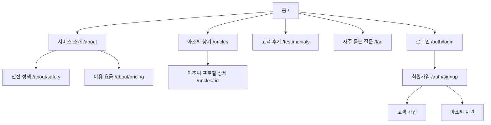
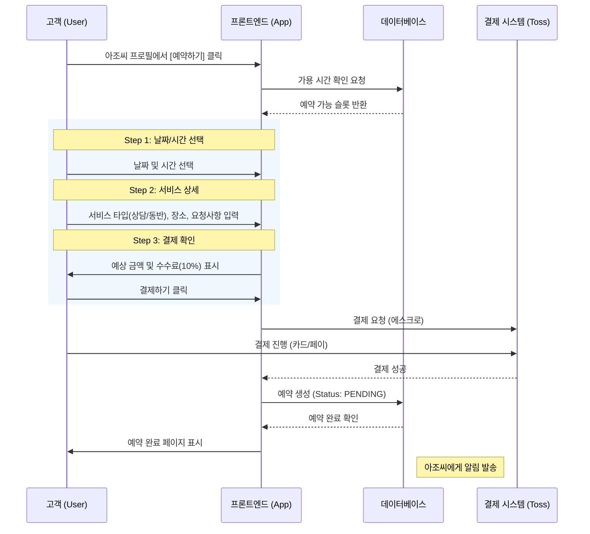
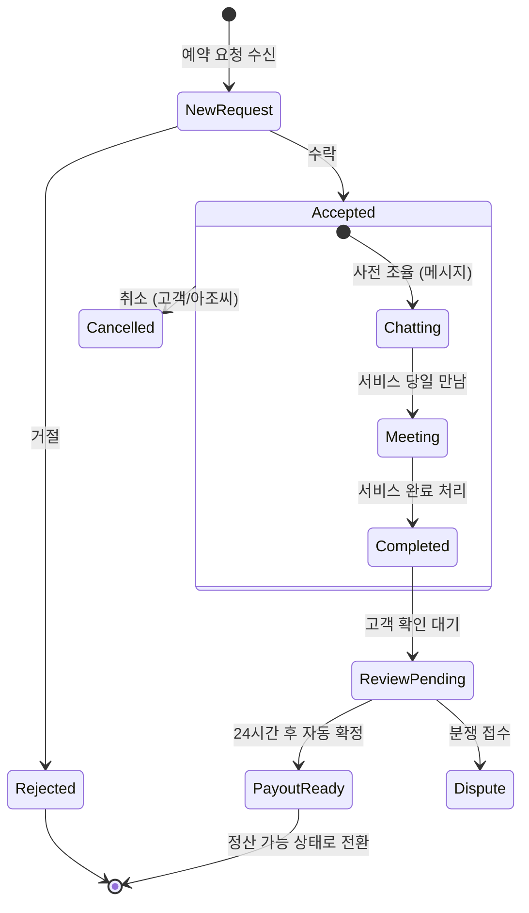
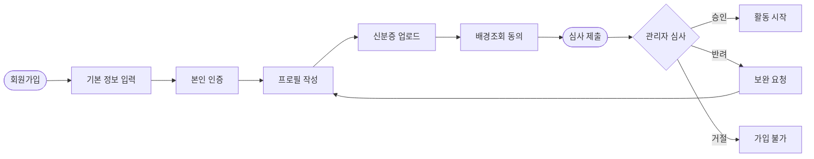

# 01. 정보 구조 및 사용자 흐름 (IA & User Flows)

**문서 상태**: 초안 (Draft)
**작성일**: 2026-01-10
**기반 문서**: [01-website-planning.md](../PHASE%200/01-website-planning.md)

---

## 📌 개요
이 문서는 '아조씨 렌탈' 플랫폼의 상세 정보 구조(IA)와 핵심 사용자 시나리오의 시각적 흐름도를 정의합니다. 개발 단계에서 라우팅 구조와 사용자 경험(UX) 로직의 기준이 됩니다.

---

## 🗺️ 1. 상세 사이트맵 (Refined Sitemap)

### 1.1 공개 영영 (Public Zone)
누구나 접근 가능한 마케팅 및 탐색 영역입니다.

### 1.2 고객 포털 (Customer Portal)
서비스를 이용하는 일반 사용자를 위한 영역입니다.

- **Main URL**: `/customer`
- **Navigation**: Desktop (Header), Mobile (Bottom Tab)

| 레벨 1 (탭/메뉴) | 레벨 2 (서브 메뉴/페이지) | 주요 기능 |
|------------------|---------------------------|-----------|
| **홈 (대시보드)** | `/customer/dashboard` | 추천 아조씨, 최근 본 아조씨, 알림 요약 |
| **탐색** | `/customer/search` | 필터(지역/태그/가격), 지도 보기, 정렬 |
| **내 예약** | `/customer/bookings` | 예정된 예약, 지난 예약, 취소/환불 내역 |
| | `/customer/bookings/:id` | 예약 상세, 아조씨 연락처, 신고하기 |
| **메시지** | `/customer/messages` | 채팅 목록, 안 읽은 메시지 배지 |
| | `/customer/messages/:id` | 1:1 채팅방, 사진 전송, 위치 공유 |
| **내 정보** | `/customer/profile` | 프로필 수정, 결제 수단 관리, 알림 설정 |
| | `/customer/wishlist` | 찜한 아조씨 목록 |

### 1.3 아조씨 포털 (Uncle Portal)
서비스를 제공하는 공급자를 위한 영역입니다.

- **Main URL**: `/uncle`
- **Navigation**: Desktop (Header), Mobile (Bottom Tab)

| 레벨 1 (탭/메뉴) | 레벨 2 (서브 메뉴/페이지) | 주요 기능 |
|------------------|---------------------------|-----------|
| **대시보드** | `/uncle/dashboard` | 오늘의 일정, 수익 요약, 평점 현황 |
| **예약 관리** | `/uncle/requests` | 신규 요청(수락/거절), 확정된 일정 |
| **일정 관리** | `/uncle/schedule` | 가용 시간 설정, 휴무일 지정 (캘린더 UI) |
| **메시지** | `/uncle/messages` | 고객 1:1 채팅 |
| **수익/정산** | `/uncle/earnings` | 수익 리포트, 정산 신청, 계좌 관리 |
| **프로필 관리** | `/uncle/profile` | 자기소개 수정, 사진 관리, 스킬 태그 설정 |

---

## 🌊 2. 핵심 사용자 흐름 (Core User Flows)

### 2.1 고객: 예약 프로세스 (Customer Booking Flow)
가장 중요한 비즈니스 로직인 '예약'의 단계별 흐름입니다.

### 2.2 아조씨: 예약 수락 및 수행 (Uncle Service Flow)
공급자가 예약을 처리하고 정산을 받는 흐름입니다.

### 2.3 아조씨: 온보딩 및 검증 (Uncle Onboarding Flow)
신뢰성을 보장하기 위한 엄격한 아조씨 등록 절차입니다.

---

## ⚙️ 3. 태스크 흐름 상세 (Detailed Task Flows)

### 3.1 검색 및 필터링 로직
고객이 원하는 아조씨를 찾는 과정의 로직입니다.

1. **진입점**: 메인 홈 검색바 또는 탐색 탭
2. **기본 정렬**: 추천순 (평점 + 응답률 + 거리 가중치 적용)
3. **필터 옵션**:
   - **지역**: 시/도 > 구/군 단위 (예: 서울 > 강남구)
   - **카테고리**: 말동무 / 고민상담 / 취미활동 / 쇼핑동행 / 기타
   - **가격**: 시간당 요금 범위 슬라이더
   - **일정**: 특정 날짜/시간에 가능한 아조씨만 보기
4. **결과 표시**:
   - **카드형 UI**: 사진(대표), 닉네임, 나이, 평점, 대표 태그, 요금
   - **품절 처리**: 예약 불가 아조씨는 리스트 하단으로 조정하거나 '마감' 배지 표시

### 3.2 환불 및 취소 정책 로직 (자동화)
시스템에서 자동으로 처리해야 하는 환불 규정입니다.

| 취소 시점 | 환불율 | 비고 |
|-----------|--------|------|
| **예약 24시간 전** | 100% 환불 | 수수료 없음 |
| **예약 24시간 이내** | 50% 환불 | 플랫폼 수수료 및 위약금 공제 |
| **노쇼 (No-Show)** | 0% 환불 | 고객 불참 시 환불 불가 |
| **아조씨 귀책 취소** | 100% 환불 | 아조씨 패널티 부과 (노출 순위 하락) |

---

## 📱 4. UX/UI 레이아웃 명세 (Layout Specs)

### 4.1 공통 레이아웃 구조 (Responsive)

| 영역 | 데스크톱 (Desktop > 768px) | 모바일 (Mobile <= 768px) |
|------|---------------------------|--------------------------|
| **Header** | 로고 + GNB(텍스트 메뉴) + 유저메뉴 | 로고 + 알림 아이콘 |
| **Nav** | 헤더에 포함 | **Bottom Tab Bar** (5개 탭) |
| **Content** | Max-width 1200px, 중앙 정렬 | Full width, 좌우 패딩 16px |
| **Sidebar** | 필터, 프로필 요약 등 표시 | (없음) 필요 시 Bottom Sheet 사용 |
| **Action** | 버튼 인라인 배치 | **Fixed Bottom Button** (화면 하단 고정) |

### 4.2 모바일 인터랙션 가이드 (Mobile Interaction)
한국 사용자에게 익숙한 모바일 UX 패턴을 적용합니다.

- **뒤로가기**: 상단 헤더 좌측 `<` 아이콘 또는 스와이프 제스처 지원
- **모달/팝업**: 화면 전체를 덮는 Full-screen Modal보다 하단에서 올라오는 **Bottom Sheet** 우선 사용 (필터, 옵션 선택 등)
- **입력 폼**: 키보드가 올라올 때 입력 필드가 가려지지 않도록 **Keyboard Avoid View** 처리 필수
- **로딩 상태**: 화면 중앙 스피너보다는 **Skeleton UI** (뼈대 UI)를 사용하여 체감 속도 향상

### 4.3 데스크톱 인터랙션 가이드
- **Hover 효과**: 버튼 및 카드에 마우스 오버 시 미세한 줌인(Scale up) 또는 그림자 강화 효과 (생동감 부여)
- **패럴렉스**: 랜딩 페이지 및 주요 소개 섹션에서 스크롤 깊이감 적용
- **다단 레이아웃**: 충분한 화면 공간을 활용하여 정보 계층 구조 시각화 (좌측 메뉴 - 우측 컨텐츠)

---

## ✅ 검토 요청 사항
이 문서는 개발을 위한 정보 구조의 초안입니다. 다음 단계(디자인 시스템)로 넘어가기 전 확인이 필요합니다.

1. **상세 사이트맵**: 누락된 페이지나 뎁스가 너무 깊은 구조가 없는지?
2. **예약 흐름**: 3단계 예약 절차(날짜 -> 상세 -> 결제)가 적절한지?
3. **아조씨 검증**: 회원가입 후 즉시 활동이 아닌 '관리자 승인' 단계를 거치는 것이 맞는지? (현재 로직: 필수)
